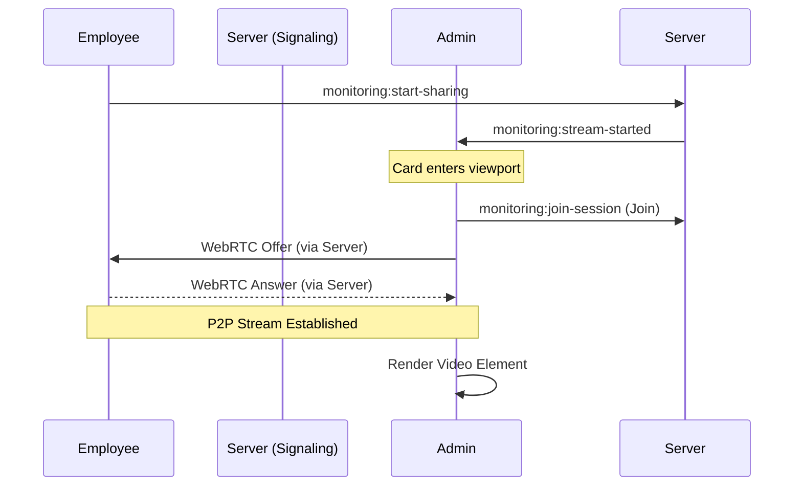

# Monitoring System Documentation

The Monitoring System is a high-performance, real-time screen sharing solution designed for administrators to observe employee activities in a CCTV-style interface. It is built to be scalable, low-latency, and resource-efficient.

## Technical Stack

### 1. WebRTC (Web Real-Time Communication)
- **Purpose**: The core engine for peer-to-peer (P2P) screen streaming.
- **Why it's used**: WebRTC provides the lowest possible latency for high-definition video. Unlike traditional streaming, it sends data directly between the employee and admin browsers whenever possible, significantly reducing server load.
- **Implementation**: Managed via a custom `useScreenShare` hook that handles the peer connection lifecycle, ICE candidate exchange, and stream attachment.

### 2. Socket.IO (Signaling Layer)
- **Purpose**: Acts as the "switchboard" to connect peers.
- **Why it's used**: WebRTC alone cannot find other users. Socket.IO handles the "Signaling" phase—exchanging connection information (Offers, Answers, and ICE Candidates) and monitoring stream status (online/offline).
- **Implementation**: Uses a custom `useSocket` hook with a centralized event bus for reliable communication.

### 3. React (Frontend Engine)
- **Purpose**: Manages the dynamic UI and component states.
- **Optimization**: Each `MonitoringSessionCard` is **memoized** to prevent unnecessary re-renders. Component logic is strictly decoupled to ensure that one failing stream doesn't affect the rest of the dashboard.

### 4. Intersection Observer API (Scalability Engine)
- **Purpose**: Detects which monitoring cards are currently visible to the admin.
- **Why it's used**: This is the "secret sauce" for scalability. Browsers struggle to decode many concurrent video streams.
- **Mechanism**: 
  - When a card **enters** the viewport, it automatically initiates a WebRTC connection.
  - When a card **exits** the viewport (due to scrolling), it terminates the connection and releases CPU/GPU resources.
  - This allows the system to scale to hundreds of employees while only consuming significant resources for the active viewing area.

### 5. Material UI (MUI) & Vanilla CSS
- **Purpose**: Provides a premium, high-density layout.
- **Design Decisions**: Uses a responsive 3-per-row grid with a fixed 16:9 aspect ratio to ensure a consistent CCTV-grid feel across different monitor sizes.

## System Architecture

## Scalability Limits
- **Network**: Limited primarily by the admin's download bandwidth and the employee's upload speed.
- **Client Performance**: Thanks to viewport optimization, the primary limit is the number of **visible** streams (typically 6-9 depending on monitor size). The total number of *connected* employees is virtually unlimited at the signaling layer.
